# [游늳 Live Status](https://inclusive-design.github.io/uptime): <!--live status--> **游릲 Partial outage**

This repository contains the open-source uptime monitor and status page for the [Inclusive Design Research Centre](https://idrc.ocadu.ca), powered by [Upptime](https://github.com/upptime/upptime).

<!--start: status pages-->
<!-- This summary is generated by Upptime (https://github.com/upptime/upptime) -->
<!-- Do not edit this manually, your changes will be overwritten -->
<!-- prettier-ignore -->
| URL | Status | History | Response Time | Uptime |
| --- | ------ | ------- | ------------- | ------ |
|  [idrc.ocadu.ca](https://idrc.ocadu.ca) | 游릴 Up | [idrc-ocadu-ca.yml](https://github.com/inclusive-design/uptime/commits/HEAD/history/idrc-ocadu-ca.yml) | 

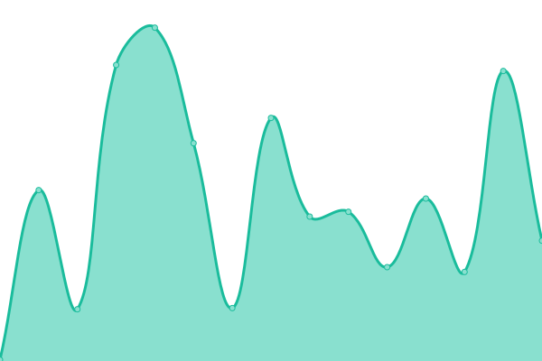 100ms
     
 | 

<a href="https://status.incd.ca/history/idrc-ocadu-ca">100.00%</a>
    

|  [sojustrepairit.ca](sojustrepairit.ca) | 游릴 Up | [sojustrepairit-ca.yml](https://github.com/inclusive-design/uptime/commits/HEAD/history/sojustrepairit-ca.yml) | 

 535ms
     
 | 

<a href="https://status.incd.ca/history/sojustrepairit-ca">99.61%</a>
    

|  [www.sojustrepairit.ca](www.sojustrepairit.ca) | 游릴 Up | [www-sojustrepairit-ca.yml](https://github.com/inclusive-design/uptime/commits/HEAD/history/www-sojustrepairit-ca.yml) | 

 293ms
     
 | 

<a href="https://status.incd.ca/history/www-sojustrepairit-ca">99.61%</a>
    

|  [floeproject.org](floeproject.org) | 游릴 Up | [floeproject-org.yml](https://github.com/inclusive-design/uptime/commits/HEAD/history/floeproject-org.yml) | 

 263ms
     
 | 

<a href="https://status.incd.ca/history/floeproject-org">100.00%</a>
    

|  [www.floeproject.org](www.floeproject.org) | 游릴 Up | [www-floeproject-org.yml](https://github.com/inclusive-design/uptime/commits/HEAD/history/www-floeproject-org.yml) | 

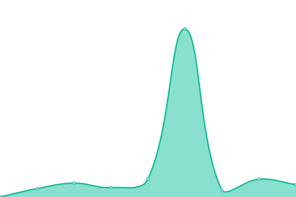 444ms
     
 | 

<a href="https://status.incd.ca/history/www-floeproject-org">99.61%</a>
    

|  [handbook.floeproject.org](handbook.floeproject.org) | 游릴 Up | [handbook-floeproject-org.yml](https://github.com/inclusive-design/uptime/commits/HEAD/history/handbook-floeproject-org.yml) | 

 285ms
     
 | 

<a href="https://status.incd.ca/history/handbook-floeproject-org">100.00%</a>
    

|  [karisma-stories.floeproject.org](karisma-stories.floeproject.org) | 游릴 Up | [karisma-stories-floeproject-org.yml](https://github.com/inclusive-design/uptime/commits/HEAD/history/karisma-stories-floeproject-org.yml) | 

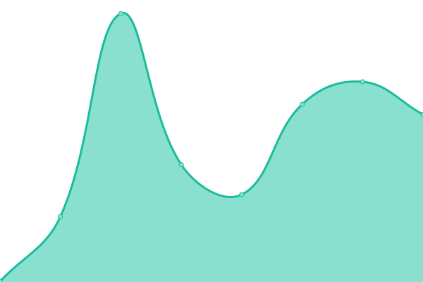 196ms
     
 | 

<a href="https://status.incd.ca/history/karisma-stories-floeproject-org">100.00%</a>
    

|  [metadata.floeproject.org](metadata.floeproject.org/demos/metadata) | 游릴 Up | [metadata-floeproject-org.yml](https://github.com/inclusive-design/uptime/commits/HEAD/history/metadata-floeproject-org.yml) | 

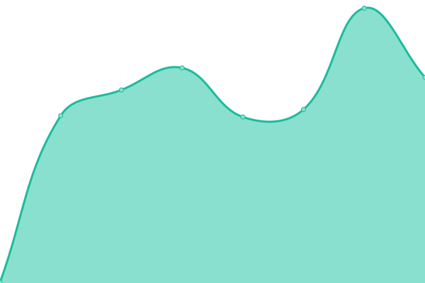 238ms
     
 | 

<a href="https://status.incd.ca/history/metadata-floeproject-org">100.00%</a>
    

|  [staging-stories.floeproject.org](staging-stories.floeproject.org) | 游릴 Up | [staging-stories-floeproject-org.yml](https://github.com/inclusive-design/uptime/commits/HEAD/history/staging-stories-floeproject-org.yml) | 

 234ms
     
 | 

<a href="https://status.incd.ca/history/staging-stories-floeproject-org">100.00%</a>
    

|  [stories.floeproject.org](stories.floeproject.org) | 游릴 Up | [stories-floeproject-org.yml](https://github.com/inclusive-design/uptime/commits/HEAD/history/stories-floeproject-org.yml) | 

 232ms
     
 | 

<a href="https://status.incd.ca/history/stories-floeproject-org">100.00%</a>
    

|  [codelearncreate.ca](codelearncreate.ca) | 游릴 Up | [codelearncreate-ca.yml](https://github.com/inclusive-design/uptime/commits/HEAD/history/codelearncreate-ca.yml) | 

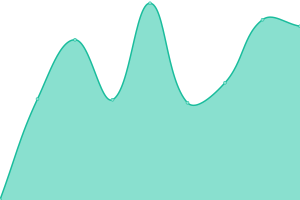 517ms
     
 | 

<a href="https://status.incd.ca/history/codelearncreate-ca">99.61%</a>
    

|  [prototype.codelearncreate.ca](prototype.codelearncreate.ca) | 游릴 Up | [prototype-codelearncreate-ca.yml](https://github.com/inclusive-design/uptime/commits/HEAD/history/prototype-codelearncreate-ca.yml) | 

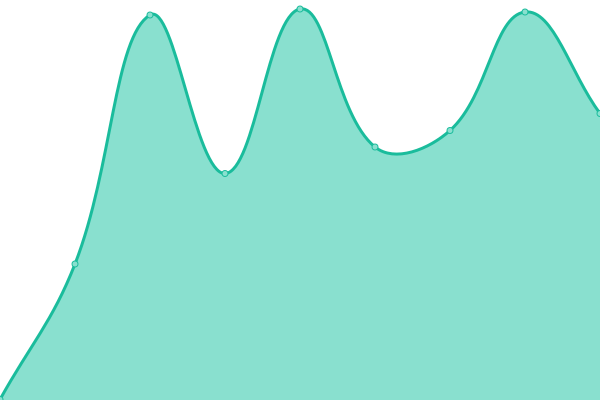 506ms
     
 | 

<a href="https://status.incd.ca/history/prototype-codelearncreate-ca">99.61%</a>
    

|  [resources.codelearncreate.ca](resources.codelearncreate.ca) | 游릴 Up | [resources-codelearncreate-ca.yml](https://github.com/inclusive-design/uptime/commits/HEAD/history/resources-codelearncreate-ca.yml) | 

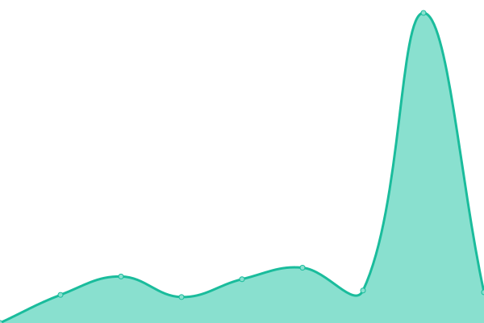 482ms
     
 | 

<a href="https://status.incd.ca/history/resources-codelearncreate-ca">99.61%</a>
    

|  [www.codelearncreate.ca](www.codelearncreate.ca) | 游릴 Up | [www-codelearncreate-ca.yml](https://github.com/inclusive-design/uptime/commits/HEAD/history/www-codelearncreate-ca.yml) | 

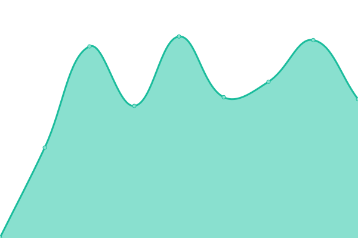 343ms
     
 | 

<a href="https://status.incd.ca/history/www-codelearncreate-ca">99.61%</a>
    

|  [codelearncreate.com](codelearncreate.com) | 游릴 Up | [codelearncreate-com.yml](https://github.com/inclusive-design/uptime/commits/HEAD/history/codelearncreate-com.yml) | 

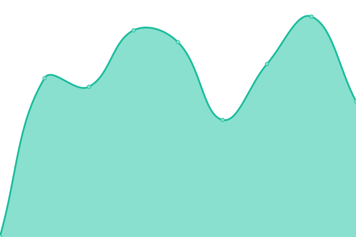 331ms
     
 | 

<a href="https://status.incd.ca/history/codelearncreate-com">99.61%</a>
    

|  [prototype.codelearncreate.com](prototype.codelearncreate.com) | 游릴 Up | [prototype-codelearncreate-com.yml](https://github.com/inclusive-design/uptime/commits/HEAD/history/prototype-codelearncreate-com.yml) | 

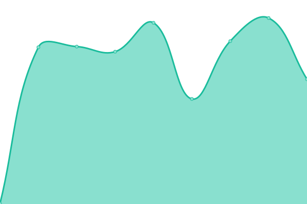 376ms
     
 | 

<a href="https://status.incd.ca/history/prototype-codelearncreate-com">99.61%</a>
    

|  [resources.codelearncreate.com](resources.codelearncreate.com) | 游릴 Up | [resources-codelearncreate-com.yml](https://github.com/inclusive-design/uptime/commits/HEAD/history/resources-codelearncreate-com.yml) | 

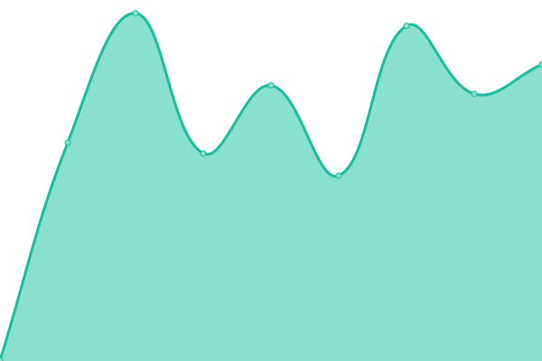 355ms
     
 | 

<a href="https://status.incd.ca/history/resources-codelearncreate-com">99.61%</a>
    

|  [www.codelearncreate.com](www.codelearncreate.com) | 游릴 Up | [www-codelearncreate-com.yml](https://github.com/inclusive-design/uptime/commits/HEAD/history/www-codelearncreate-com.yml) | 

 363ms
     
 | 

<a href="https://status.incd.ca/history/www-codelearncreate-com">99.61%</a>
    

|  [fluidinfusion.ca](fluidinfusion.ca) | 游릴 Up | [fluidinfusion-ca.yml](https://github.com/inclusive-design/uptime/commits/HEAD/history/fluidinfusion-ca.yml) | 

 494ms
     
 | 

<a href="https://status.incd.ca/history/fluidinfusion-ca">99.61%</a>
    

|  [www.fluidinfusion.ca](www.fluidinfusion.ca) | 游릴 Up | [www-fluidinfusion-ca.yml](https://github.com/inclusive-design/uptime/commits/HEAD/history/www-fluidinfusion-ca.yml) | 

 297ms
     
 | 

<a href="https://status.incd.ca/history/www-fluidinfusion-ca">99.61%</a>
    

|  [inclusivelearning.ca](inclusivelearning.ca) | 游릴 Up | [inclusivelearning-ca.yml](https://github.com/inclusive-design/uptime/commits/HEAD/history/inclusivelearning-ca.yml) | 

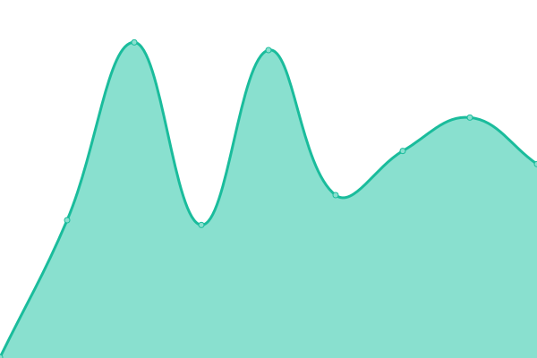 349ms
     
 | 

<a href="https://status.incd.ca/history/inclusivelearning-ca">99.61%</a>
    

|  [www.inclusivelearning.ca](www.inclusivelearning.ca) | 游릴 Up | [www-inclusivelearning-ca.yml](https://github.com/inclusive-design/uptime/commits/HEAD/history/www-inclusivelearning-ca.yml) | 

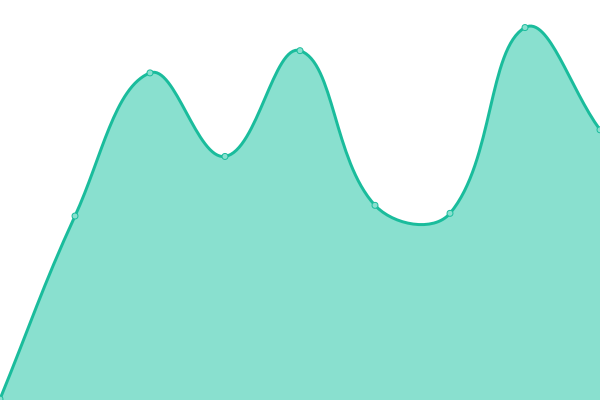 293ms
     
 | 

<a href="https://status.incd.ca/history/www-inclusivelearning-ca">99.61%</a>
    

|  [in-kind.ca](in-kind.ca) | 游릴 Up | [in-kind-ca.yml](https://github.com/inclusive-design/uptime/commits/HEAD/history/in-kind-ca.yml) | 

 340ms
     
 | 

<a href="https://status.incd.ca/history/in-kind-ca">99.61%</a>
    

|  [www.in-kind.ca](www.in-kind.ca) | 游릴 Up | [www-in-kind-ca.yml](https://github.com/inclusive-design/uptime/commits/HEAD/history/www-in-kind-ca.yml) | 

 276ms
     
 | 

<a href="https://status.incd.ca/history/www-in-kind-ca">99.61%</a>
    

|  [idrc.ocadu.ca](idrc.ocadu.ca) | 游릴 Up | [idrc-ocadu-ca.yml](https://github.com/inclusive-design/uptime/commits/HEAD/history/idrc-ocadu-ca.yml) | 

 100ms
     
 | 

<a href="https://status.incd.ca/history/idrc-ocadu-ca">100.00%</a>
    

|  [acaw.idrc.ocadu.ca](acaw.idrc.ocadu.ca) | 游릴 Up | [acaw-idrc-ocadu-ca.yml](https://github.com/inclusive-design/uptime/commits/HEAD/history/acaw-idrc-ocadu-ca.yml) | 

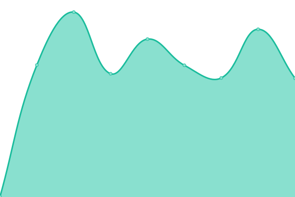 446ms
     
 | 

<a href="https://status.incd.ca/history/acaw-idrc-ocadu-ca">99.61%</a>
    

|  [cama.idrc.ocadu.ca](cama.idrc.ocadu.ca) | 游릴 Up | [cama-idrc-ocadu-ca.yml](https://github.com/inclusive-design/uptime/commits/HEAD/history/cama-idrc-ocadu-ca.yml) | 

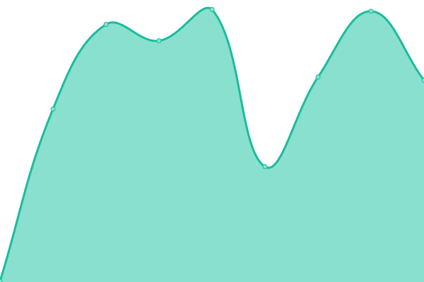 337ms
     
 | 

<a href="https://status.incd.ca/history/cama-idrc-ocadu-ca">99.61%</a>
    

|  [lists.idrc.ocadu.ca](lists.idrc.ocadu.ca) | 游릴 Up | [lists-idrc-ocadu-ca.yml](https://github.com/inclusive-design/uptime/commits/HEAD/history/lists-idrc-ocadu-ca.yml) | 

 1025ms
     
 | 

<a href="https://status.incd.ca/history/lists-idrc-ocadu-ca">99.93%</a>
    

|  [www.idrc.ocadu.ca](www.idrc.ocadu.ca) | 游릴 Up | [www-idrc-ocadu-ca.yml](https://github.com/inclusive-design/uptime/commits/HEAD/history/www-idrc-ocadu-ca.yml) | 

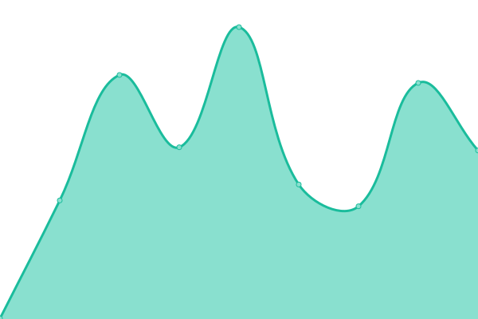 181ms
     
 | 

<a href="https://status.incd.ca/history/www-idrc-ocadu-ca">100.00%</a>
    

|  [acaw-cama.idrc.ocadu.ca](acaw-cama.idrc.ocadu.ca) | 游릴 Up | [acaw-cama-idrc-ocadu-ca.yml](https://github.com/inclusive-design/uptime/commits/HEAD/history/acaw-cama-idrc-ocadu-ca.yml) | 

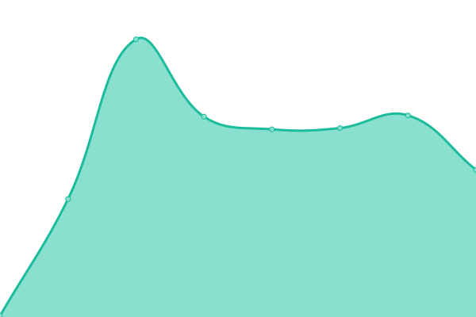 104ms
     
 | 

<a href="https://status.incd.ca/history/acaw-cama-idrc-ocadu-ca">100.00%</a>
    

|  [adod.idrc.ocadu.ca](adod.idrc.ocadu.ca) | 游릴 Up | [adod-idrc-ocadu-ca.yml](https://github.com/inclusive-design/uptime/commits/HEAD/history/adod-idrc-ocadu-ca.yml) | 

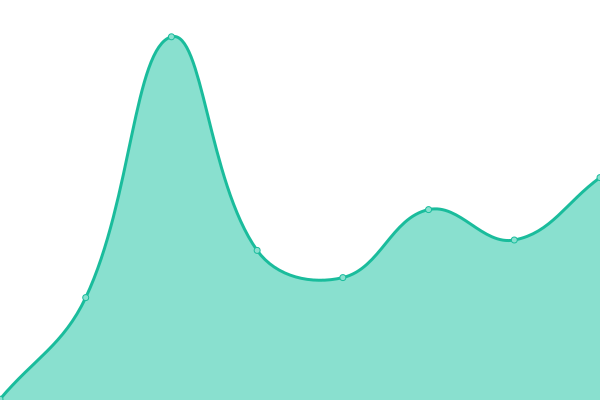 152ms
     
 | 

<a href="https://status.incd.ca/history/adod-idrc-ocadu-ca">100.00%</a>
    

|  [aegis.idrc.ocadu.ca](aegis.idrc.ocadu.ca) | 游릴 Up | [aegis-idrc-ocadu-ca.yml](https://github.com/inclusive-design/uptime/commits/HEAD/history/aegis-idrc-ocadu-ca.yml) | 

 175ms
     
 | 

<a href="https://status.incd.ca/history/aegis-idrc-ocadu-ca">100.00%</a>
    

|  [cnice.idrc.ocadu.ca](cnice.idrc.ocadu.ca) | 游릴 Up | [cnice-idrc-ocadu-ca.yml](https://github.com/inclusive-design/uptime/commits/HEAD/history/cnice-idrc-ocadu-ca.yml) | 

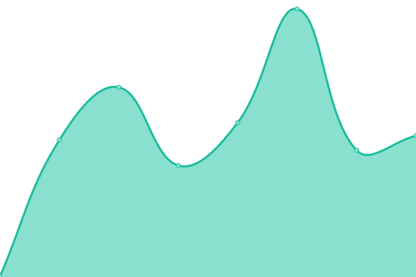 146ms
     
 | 

<a href="https://status.incd.ca/history/cnice-idrc-ocadu-ca">100.00%</a>
    

|  [courses.idrc.ocadu.ca](courses.idrc.ocadu.ca) | 游릴 Up | [courses-idrc-ocadu-ca.yml](https://github.com/inclusive-design/uptime/commits/HEAD/history/courses-idrc-ocadu-ca.yml) | 

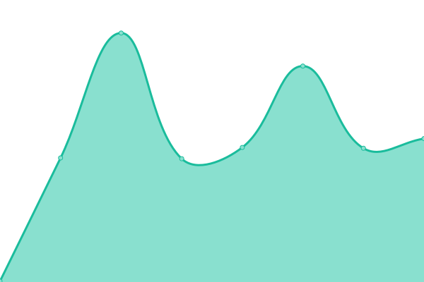 147ms
     
 | 

<a href="https://status.incd.ca/history/courses-idrc-ocadu-ca">100.00%</a>
    

|  [culturall.idrc.ocadu.ca](culturall.idrc.ocadu.ca) | 游릴 Up | [culturall-idrc-ocadu-ca.yml](https://github.com/inclusive-design/uptime/commits/HEAD/history/culturall-idrc-ocadu-ca.yml) | 

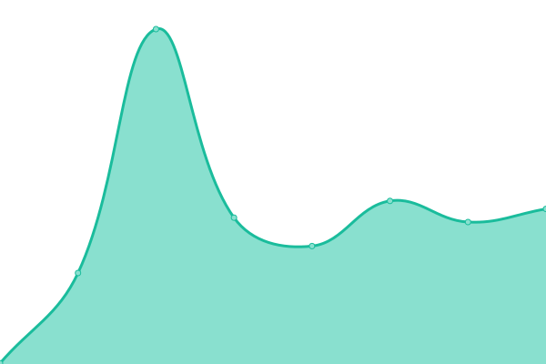 144ms
     
 | 

<a href="https://status.incd.ca/history/culturall-idrc-ocadu-ca">100.00%</a>
    

|  [culturall1.idrc.ocadu.ca](culturall1.idrc.ocadu.ca) | 游릴 Up | [culturall1-idrc-ocadu-ca.yml](https://github.com/inclusive-design/uptime/commits/HEAD/history/culturall1-idrc-ocadu-ca.yml) | 

 160ms
     
 | 

<a href="https://status.incd.ca/history/culturall1-idrc-ocadu-ca">100.00%</a>
    

|  [culturall2.idrc.ocadu.ca](culturall2.idrc.ocadu.ca) | 游릴 Up | [culturall2-idrc-ocadu-ca.yml](https://github.com/inclusive-design/uptime/commits/HEAD/history/culturall2-idrc-ocadu-ca.yml) | 

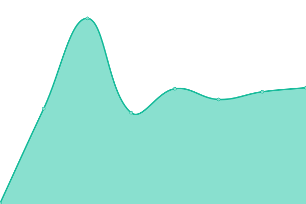 181ms
     
 | 

<a href="https://status.incd.ca/history/culturall2-idrc-ocadu-ca">100.00%</a>
    

|  [deep.idrc.ocadu.ca](deep.idrc.ocadu.ca) | 游릴 Up | [deep-idrc-ocadu-ca.yml](https://github.com/inclusive-design/uptime/commits/HEAD/history/deep-idrc-ocadu-ca.yml) | 

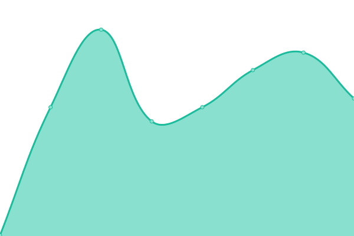 153ms
     
 | 

<a href="https://status.incd.ca/history/deep-idrc-ocadu-ca">100.00%</a>
    

|  [ilc.idrc.ocadu.ca](ilc.idrc.ocadu.ca) | 游릴 Up | [ilc-idrc-ocadu-ca.yml](https://github.com/inclusive-design/uptime/commits/HEAD/history/ilc-idrc-ocadu-ca.yml) | 

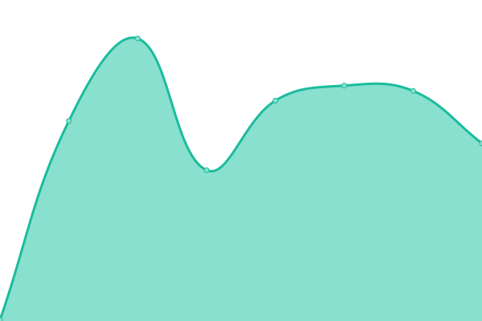 154ms
     
 | 

<a href="https://status.incd.ca/history/ilc-idrc-ocadu-ca">100.00%</a>
    

|  [legacy.idrc.ocadu.ca](legacy.idrc.ocadu.ca) | 游릴 Up | [legacy-idrc-ocadu-ca.yml](https://github.com/inclusive-design/uptime/commits/HEAD/history/legacy-idrc-ocadu-ca.yml) | 

 148ms
     
 | 

<a href="https://status.incd.ca/history/legacy-idrc-ocadu-ca">100.00%</a>
    

|  [nide.snow.idrc.ocadu.ca](nide.snow.idrc.ocadu.ca) | 游릴 Up | [nide-snow-idrc-ocadu-ca.yml](https://github.com/inclusive-design/uptime/commits/HEAD/history/nide-snow-idrc-ocadu-ca.yml) | 

 166ms
     
 | 

<a href="https://status.incd.ca/history/nide-snow-idrc-ocadu-ca">100.00%</a>
    

|  [opencaps.idrc.ocadu.ca](opencaps.idrc.ocadu.ca) | 游릴 Up | [opencaps-idrc-ocadu-ca.yml](https://github.com/inclusive-design/uptime/commits/HEAD/history/opencaps-idrc-ocadu-ca.yml) | 

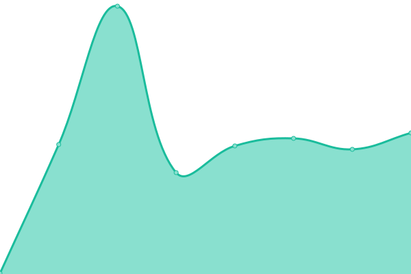 147ms
     
 | 

<a href="https://status.incd.ca/history/opencaps-idrc-ocadu-ca">100.00%</a>
    

|  [opendoors.idrc.ocadu.ca](opendoors.idrc.ocadu.ca) | 游릴 Up | [opendoors-idrc-ocadu-ca.yml](https://github.com/inclusive-design/uptime/commits/HEAD/history/opendoors-idrc-ocadu-ca.yml) | 

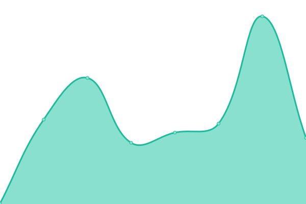 207ms
     
 | 

<a href="https://status.incd.ca/history/opendoors-idrc-ocadu-ca">100.00%</a>
    

|  [outside-in.idrc.ocadu.ca](outside-in.idrc.ocadu.ca) | 游릴 Up | [outside-in-idrc-ocadu-ca.yml](https://github.com/inclusive-design/uptime/commits/HEAD/history/outside-in-idrc-ocadu-ca.yml) | 

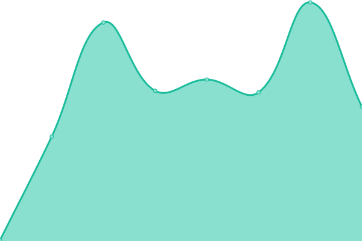 162ms
     
 | 

<a href="https://status.incd.ca/history/outside-in-idrc-ocadu-ca">100.00%</a>
    

|  [pipedaproject.idrc.ocadu.ca](pipedaproject.idrc.ocadu.ca) | 游릴 Up | [pipedaproject-idrc-ocadu-ca.yml](https://github.com/inclusive-design/uptime/commits/HEAD/history/pipedaproject-idrc-ocadu-ca.yml) | 

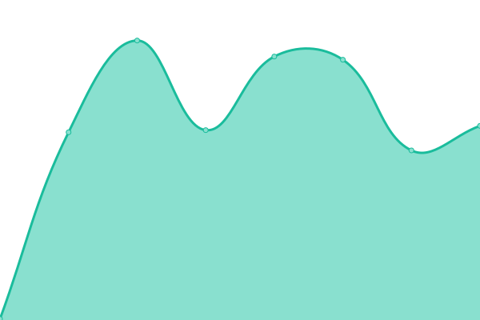 143ms
     
 | 

<a href="https://status.incd.ca/history/pipedaproject-idrc-ocadu-ca">100.00%</a>
    

|  [snow.idrc.ocadu.ca](snow.idrc.ocadu.ca) | 游릴 Up | [snow-idrc-ocadu-ca.yml](https://github.com/inclusive-design/uptime/commits/HEAD/history/snow-idrc-ocadu-ca.yml) | 

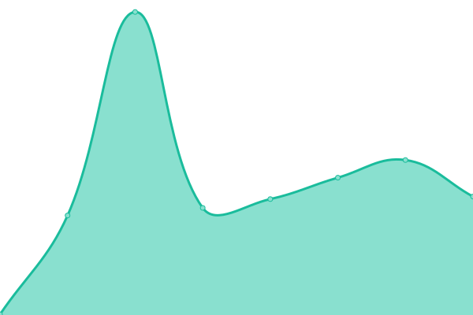 142ms
     
 | 

<a href="https://status.incd.ca/history/snow-idrc-ocadu-ca">100.00%</a>
    

|  [static.idrc.ocadu.ca](static.idrc.ocadu.ca) | 游릴 Up | [static-idrc-ocadu-ca.yml](https://github.com/inclusive-design/uptime/commits/HEAD/history/static-idrc-ocadu-ca.yml) | 

 143ms
     
 | 

<a href="https://status.incd.ca/history/static-idrc-ocadu-ca">100.00%</a>
    

|  [stretch.idrc.ocadu.ca](stretch.idrc.ocadu.ca) | 游릴 Up | [stretch-idrc-ocadu-ca.yml](https://github.com/inclusive-design/uptime/commits/HEAD/history/stretch-idrc-ocadu-ca.yml) | 

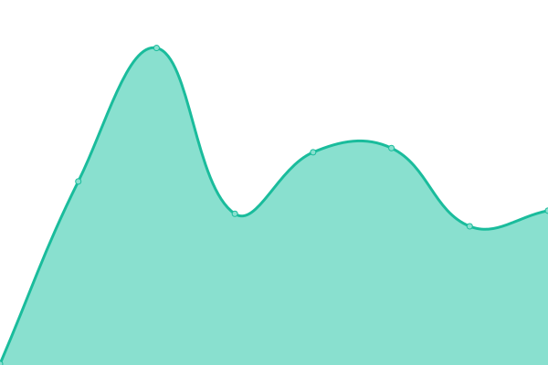 139ms
     
 | 

<a href="https://status.incd.ca/history/stretch-idrc-ocadu-ca">100.00%</a>
    

|  [timetrack.idrc.ocadu.ca](timetrack.idrc.ocadu.ca) | 游린 Down | [timetrack-idrc-ocadu-ca.yml](https://github.com/inclusive-design/uptime/commits/HEAD/history/timetrack-idrc-ocadu-ca.yml) | 

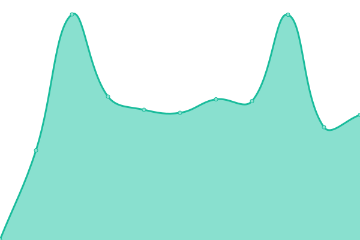 408ms
     
 | 

<a href="https://status.incd.ca/history/timetrack-idrc-ocadu-ca">44.03%</a>
    

|  [www.snow.idrc.ocadu.ca](www.snow.idrc.ocadu.ca) | 游릴 Up | [www-snow-idrc-ocadu-ca.yml](https://github.com/inclusive-design/uptime/commits/HEAD/history/www-snow-idrc-ocadu-ca.yml) | 

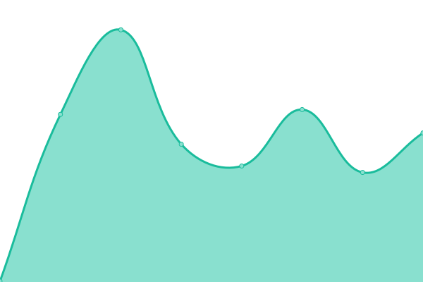 157ms
     
 | 

<a href="https://status.incd.ca/history/www-snow-idrc-ocadu-ca">100.00%</a>
    

|  [fluidengage.ca](fluidengage.ca) | 游릴 Up | [fluidengage-ca.yml](https://github.com/inclusive-design/uptime/commits/HEAD/history/fluidengage-ca.yml) | 

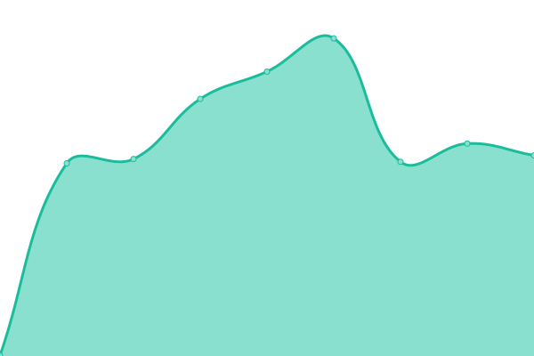 505ms
     
 | 

<a href="https://status.incd.ca/history/fluidengage-ca">99.61%</a>
    

|  [www.fluidengage.ca](www.fluidengage.ca) | 游릴 Up | [www-fluidengage-ca.yml](https://github.com/inclusive-design/uptime/commits/HEAD/history/www-fluidengage-ca.yml) | 

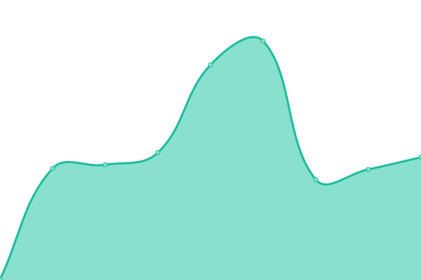 264ms
     
 | 

<a href="https://status.incd.ca/history/www-fluidengage-ca">99.61%</a>
    

|  [webpourtous.ca](webpourtous.ca) | 游릴 Up | [webpourtous-ca.yml](https://github.com/inclusive-design/uptime/commits/HEAD/history/webpourtous-ca.yml) | 

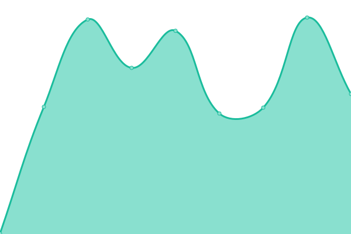 392ms
     
 | 

<a href="https://status.incd.ca/history/webpourtous-ca">99.61%</a>
    

|  [www.webpourtous.ca](www.webpourtous.ca) | 游릴 Up | [www-webpourtous-ca.yml](https://github.com/inclusive-design/uptime/commits/HEAD/history/www-webpourtous-ca.yml) | 

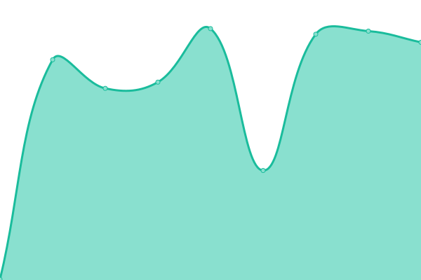 310ms
     
 | 

<a href="https://status.incd.ca/history/www-webpourtous-ca">99.61%</a>
    

|  [fluidinfusion.org](fluidinfusion.org) | 游릴 Up | [fluidinfusion-org.yml](https://github.com/inclusive-design/uptime/commits/HEAD/history/fluidinfusion-org.yml) | 

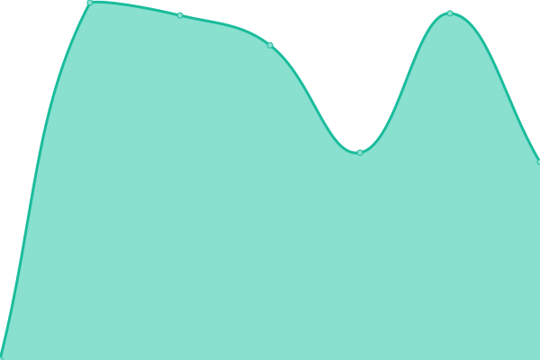 577ms
     
 | 

<a href="https://status.incd.ca/history/fluidinfusion-org">99.61%</a>
    

|  [www.fluidinfusion.org](www.fluidinfusion.org) | 游릴 Up | [www-fluidinfusion-org.yml](https://github.com/inclusive-design/uptime/commits/HEAD/history/www-fluidinfusion-org.yml) | 

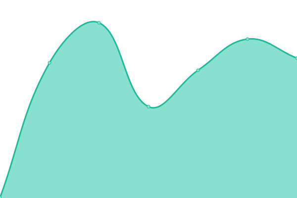 494ms
     
 | 

<a href="https://status.incd.ca/history/www-fluidinfusion-org">99.61%</a>
    

|  [bigidea.one](bigidea.one) | 游릴 Up | [bigidea-one.yml](https://github.com/inclusive-design/uptime/commits/HEAD/history/bigidea-one.yml) | 

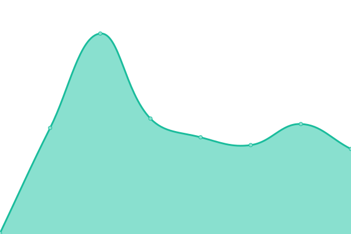 135ms
     
 | 

<a href="https://status.incd.ca/history/bigidea-one">100.00%</a>
    

|  [www.bigidea.one](www.bigidea.one) | 游릴 Up | [www-bigidea-one.yml](https://github.com/inclusive-design/uptime/commits/HEAD/history/www-bigidea-one.yml) | 

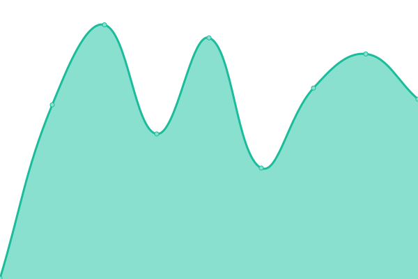 276ms
     
 | 

<a href="https://status.incd.ca/history/www-bigidea-one">99.61%</a>
    

|  [sojustrepairit.org](sojustrepairit.org) | 游릴 Up | [sojustrepairit-org.yml](https://github.com/inclusive-design/uptime/commits/HEAD/history/sojustrepairit-org.yml) | 

 107ms
     
 | 

<a href="https://status.incd.ca/history/sojustrepairit-org">100.00%</a>
    

|  [www.sojustrepairit.org](www.sojustrepairit.org) | 游릴 Up | [www-sojustrepairit-org.yml](https://github.com/inclusive-design/uptime/commits/HEAD/history/www-sojustrepairit-org.yml) | 

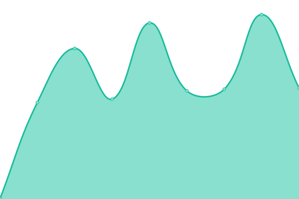 496ms
     
 | 

<a href="https://status.incd.ca/history/www-sojustrepairit-org">99.61%</a>
    

|  [stories.sojustrepairit.org](stories.sojustrepairit.org) | 游릴 Up | [stories-sojustrepairit-org.yml](https://github.com/inclusive-design/uptime/commits/HEAD/history/stories-sojustrepairit-org.yml) | 

 250ms
     
 | 

<a href="https://status.incd.ca/history/stories-sojustrepairit-org">100.00%</a>
    

|  [fluidproject.org](fluidproject.org) | 游릴 Up | [fluidproject-org.yml](https://github.com/inclusive-design/uptime/commits/HEAD/history/fluidproject-org.yml) | 

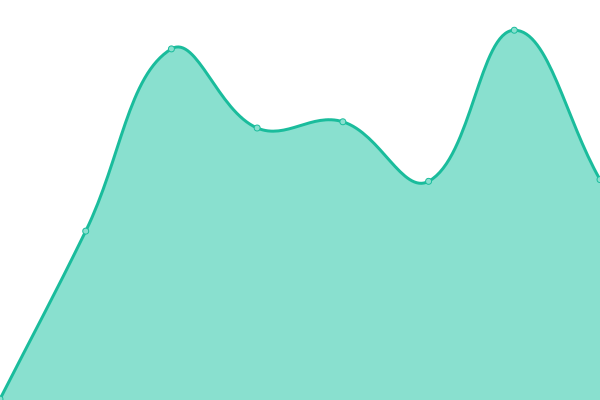 99ms
     
 | 

<a href="https://status.incd.ca/history/fluidproject-org">100.00%</a>
    

|  [issues.fluidproject.org](issues.fluidproject.org) | 游릴 Up | [issues-fluidproject-org.yml](https://github.com/inclusive-design/uptime/commits/HEAD/history/issues-fluidproject-org.yml) | 

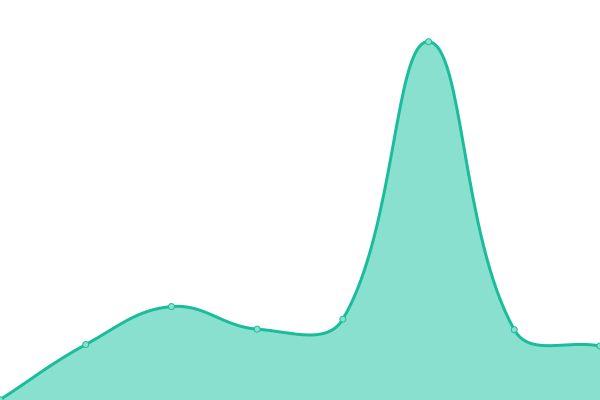 969ms
     
 | 

<a href="https://status.incd.ca/history/issues-fluidproject-org">99.61%</a>
    

|  [wiki.fluidproject.org](wiki.fluidproject.org) | 游릴 Up | [wiki-fluidproject-org.yml](https://github.com/inclusive-design/uptime/commits/HEAD/history/wiki-fluidproject-org.yml) | 

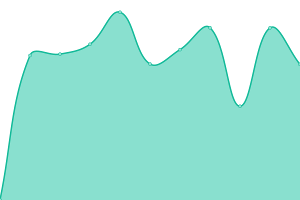 920ms
     
 | 

<a href="https://status.incd.ca/history/wiki-fluidproject-org">99.54%</a>
    

|  [www.fluidproject.org](www.fluidproject.org) | 游릴 Up | [www-fluidproject-org.yml](https://github.com/inclusive-design/uptime/commits/HEAD/history/www-fluidproject-org.yml) | 

 440ms
     
 | 

<a href="https://status.incd.ca/history/www-fluidproject-org">99.54%</a>
    

|  [build.fluidproject.org](build.fluidproject.org) | 游릴 Up | [build-fluidproject-org.yml](https://github.com/inclusive-design/uptime/commits/HEAD/history/build-fluidproject-org.yml) | 

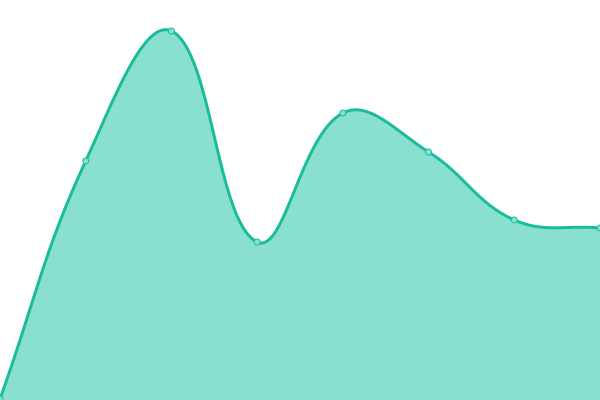 213ms
     
 | 

<a href="https://status.incd.ca/history/build-fluidproject-org">100.00%</a>
    

|  [build-chartauthoring.fluidproject.org](build-chartauthoring.fluidproject.org/demos) | 游릴 Up | [build-chartauthoring-fluidproject-org.yml](https://github.com/inclusive-design/uptime/commits/HEAD/history/build-chartauthoring-fluidproject-org.yml) | 

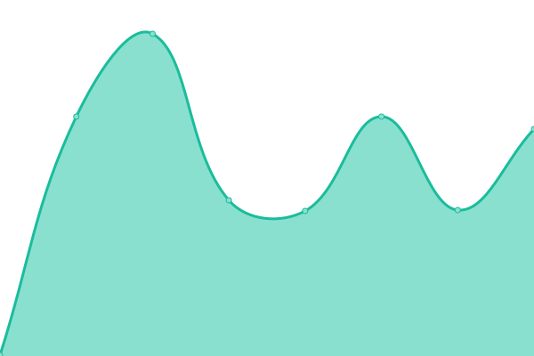 300ms
     
 | 

<a href="https://status.incd.ca/history/build-chartauthoring-fluidproject-org">100.00%</a>
    

|  [build-discoverycat.fluidproject.org](build-discoverycat.fluidproject.org/demo) | 游릴 Up | [build-discoverycat-fluidproject-org.yml](https://github.com/inclusive-design/uptime/commits/HEAD/history/build-discoverycat-fluidproject-org.yml) | 

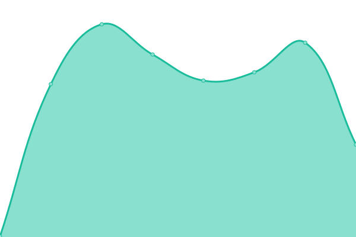 221ms
     
 | 

<a href="https://status.incd.ca/history/build-discoverycat-fluidproject-org">100.00%</a>
    

|  [build-firstdiscovery.fluidproject.org](build-firstdiscovery.fluidproject.org/demos) | 游릴 Up | [build-firstdiscovery-fluidproject-org.yml](https://github.com/inclusive-design/uptime/commits/HEAD/history/build-firstdiscovery-fluidproject-org.yml) | 

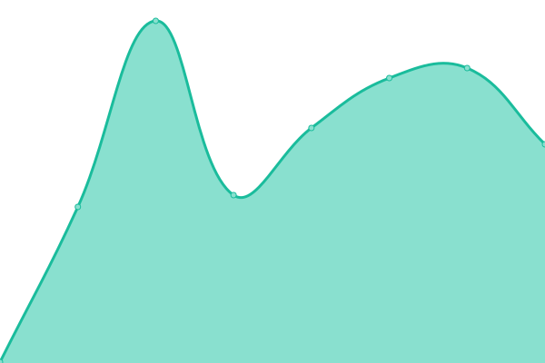 221ms
     
 | 

<a href="https://status.incd.ca/history/build-firstdiscovery-fluidproject-org">100.00%</a>
    

|  [build-infusion.fluidproject.org](build-infusion.fluidproject.org/demos/renderer) | 游릴 Up | [build-infusion-fluidproject-org.yml](https://github.com/inclusive-design/uptime/commits/HEAD/history/build-infusion-fluidproject-org.yml) | 

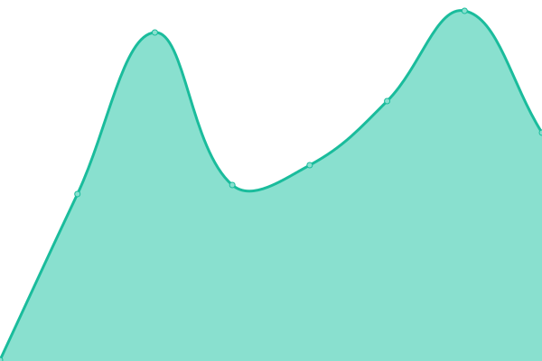 220ms
     
 | 

<a href="https://status.incd.ca/history/build-infusion-fluidproject-org">100.00%</a>
    

|  [build-musicmania.fluidproject.org](build-musicmania.fluidproject.org) | 游릴 Up | [build-musicmania-fluidproject-org.yml](https://github.com/inclusive-design/uptime/commits/HEAD/history/build-musicmania-fluidproject-org.yml) | 

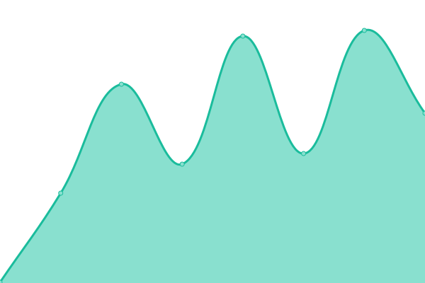 270ms
     
 | 

<a href="https://status.incd.ca/history/build-musicmania-fluidproject-org">100.00%</a>
    

|  [build-playtown.fluidproject.org](build-playtown.fluidproject.org) | 游릴 Up | [build-playtown-fluidproject-org.yml](https://github.com/inclusive-design/uptime/commits/HEAD/history/build-playtown-fluidproject-org.yml) | 

 230ms
     
 | 

<a href="https://status.incd.ca/history/build-playtown-fluidproject-org">100.00%</a>
    

|  [build-prefseditors.fluidproject.org](build-prefseditors.fluidproject.org/demos/explorationTool) | 游릴 Up | [build-prefseditors-fluidproject-org.yml](https://github.com/inclusive-design/uptime/commits/HEAD/history/build-prefseditors-fluidproject-org.yml) | 

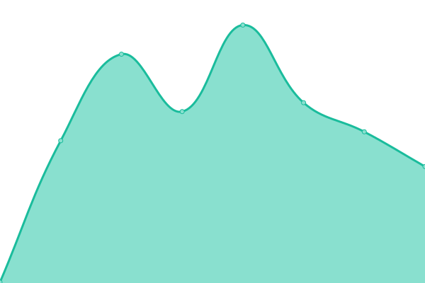 237ms
     
 | 

<a href="https://status.incd.ca/history/build-prefseditors-fluidproject-org">100.00%</a>
    

|  [build-videoplayer.fluidproject.org](build-videoplayer.fluidproject.org/demos/Mammals) | 游릴 Up | [build-videoplayer-fluidproject-org.yml](https://github.com/inclusive-design/uptime/commits/HEAD/history/build-videoplayer-fluidproject-org.yml) | 

 154ms
     
 | 

<a href="https://status.incd.ca/history/build-videoplayer-fluidproject-org">100.00%</a>
    

|  [docs.fluidproject.org](docs.fluidproject.org) | 游릴 Up | [docs-fluidproject-org.yml](https://github.com/inclusive-design/uptime/commits/HEAD/history/docs-fluidproject-org.yml) | 

 178ms
     
 | 

<a href="https://status.incd.ca/history/docs-fluidproject-org">100.00%</a>
    

|  [forge.fluidproject.org](forge.fluidproject.org) | 游릴 Up | [forge-fluidproject-org.yml](https://github.com/inclusive-design/uptime/commits/HEAD/history/forge-fluidproject-org.yml) | 

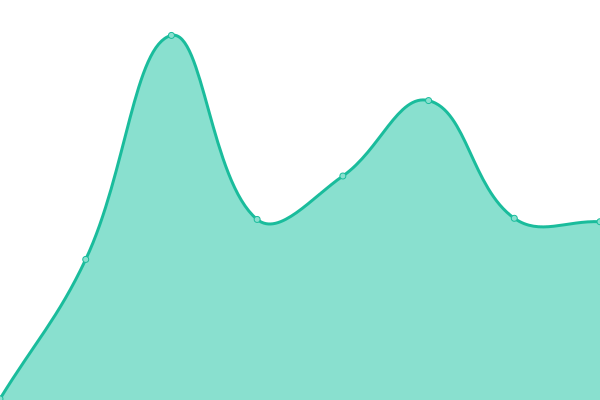 185ms
     
 | 

<a href="https://status.incd.ca/history/forge-fluidproject-org">100.00%</a>
    

|  [weavly.org](weavly.org) | 游릴 Up | [weavly-org.yml](https://github.com/inclusive-design/uptime/commits/HEAD/history/weavly-org.yml) | 

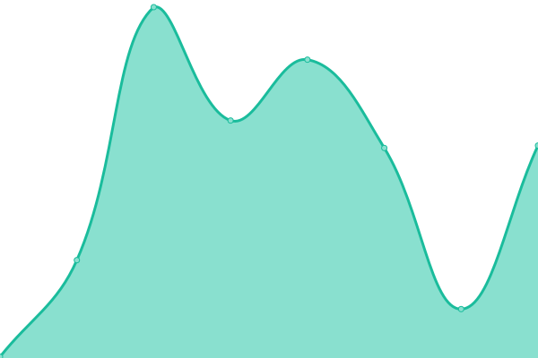 162ms
     
 | 

<a href="https://status.incd.ca/history/weavly-org">100.00%</a>
    

|  [create.weavly.org](create.weavly.org) | 游릴 Up | [create-weavly-org.yml](https://github.com/inclusive-design/uptime/commits/HEAD/history/create-weavly-org.yml) | 

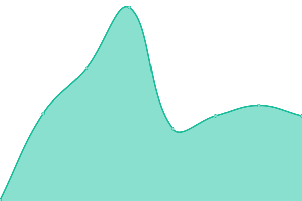 104ms
     
 | 

<a href="https://status.incd.ca/history/create-weavly-org">100.00%</a>
    

|  [co-design.weavly.org](co-design.weavly.org) | 游릴 Up | [co-design-weavly-org.yml](https://github.com/inclusive-design/uptime/commits/HEAD/history/co-design-weavly-org.yml) | 

 260ms
     
 | 

<a href="https://status.incd.ca/history/co-design-weavly-org">100.00%</a>
    

|  [www.weavly.org](www.weavly.org) | 游릴 Up | [www-weavly-org.yml](https://github.com/inclusive-design/uptime/commits/HEAD/history/www-weavly-org.yml) | 

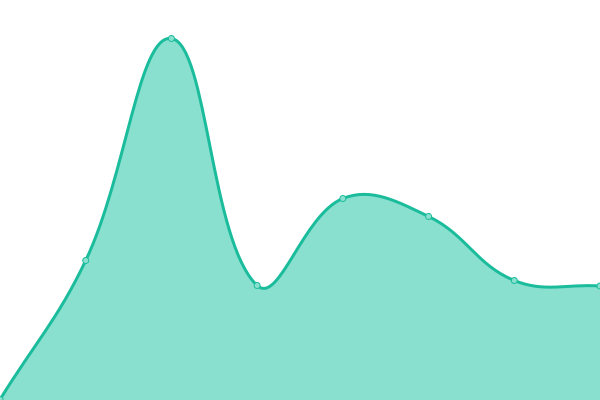 445ms
     
 | 

<a href="https://status.incd.ca/history/www-weavly-org">100.00%</a>
    

|  [achecker.ca](achecker.ca) | 游릴 Up | [achecker-ca.yml](https://github.com/inclusive-design/uptime/commits/HEAD/history/achecker-ca.yml) | 

 339ms
     
 | 

<a href="https://status.incd.ca/history/achecker-ca">99.54%</a>
    

|  [www.achecker.ca](www.achecker.ca) | 游릴 Up | [www-achecker-ca.yml](https://github.com/inclusive-design/uptime/commits/HEAD/history/www-achecker-ca.yml) | 

 285ms
     
 | 

<a href="https://status.incd.ca/history/www-achecker-ca">99.54%</a>
    

|  [codelearncreate.org](codelearncreate.org) | 游릴 Up | [codelearncreate-org.yml](https://github.com/inclusive-design/uptime/commits/HEAD/history/codelearncreate-org.yml) | 

 117ms
     
 | 

<a href="https://status.incd.ca/history/codelearncreate-org">100.00%</a>
    

|  [www.codelearncreate.org](www.codelearncreate.org) | 游릴 Up | [www-codelearncreate-org.yml](https://github.com/inclusive-design/uptime/commits/HEAD/history/www-codelearncreate-org.yml) | 

 475ms
     
 | 

<a href="https://status.incd.ca/history/www-codelearncreate-org">99.54%</a>
    

|  [build.codelearncreate.org](build.codelearncreate.org) | 游릴 Up | [build-codelearncreate-org.yml](https://github.com/inclusive-design/uptime/commits/HEAD/history/build-codelearncreate-org.yml) | 

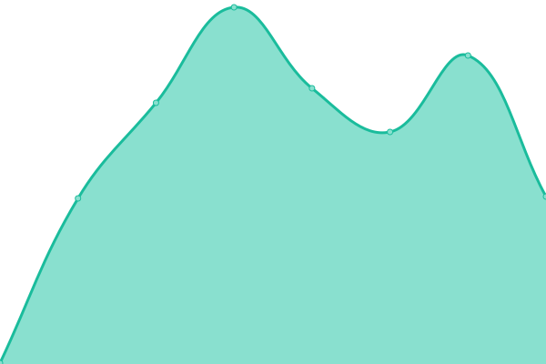 241ms
     
 | 

<a href="https://status.incd.ca/history/build-codelearncreate-org">100.00%</a>
    

|  [forest.codelearncreate.org](forest.codelearncreate.org) | 游릴 Up | [forest-codelearncreate-org.yml](https://github.com/inclusive-design/uptime/commits/HEAD/history/forest-codelearncreate-org.yml) | 

 234ms
     
 | 

<a href="https://status.incd.ca/history/forest-codelearncreate-org">100.00%</a>
    

|  [prototype.codelearncreate.org](prototype.codelearncreate.org) | 游릴 Up | [prototype-codelearncreate-org.yml](https://github.com/inclusive-design/uptime/commits/HEAD/history/prototype-codelearncreate-org.yml) | 

 239ms
     
 | 

<a href="https://status.incd.ca/history/prototype-codelearncreate-org">100.00%</a>
    

|  [resources.codelearncreate.org](resources.codelearncreate.org) | 游릴 Up | [resources-codelearncreate-org.yml](https://github.com/inclusive-design/uptime/commits/HEAD/history/resources-codelearncreate-org.yml) | 

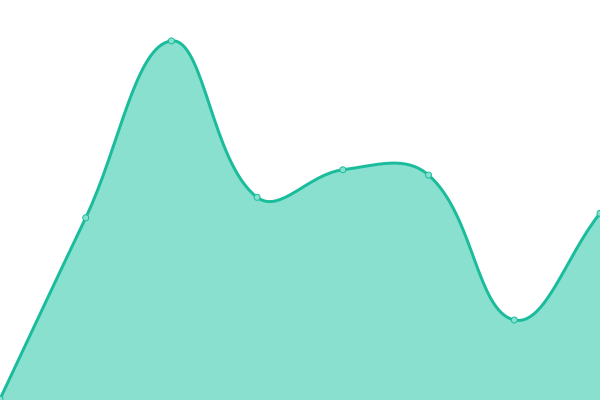 263ms
     
 | 

<a href="https://status.incd.ca/history/resources-codelearncreate-org">100.00%</a>
    

|  [space.codelearncreate.org](space.codelearncreate.org) | 游릴 Up | [space-codelearncreate-org.yml](https://github.com/inclusive-design/uptime/commits/HEAD/history/space-codelearncreate-org.yml) | 

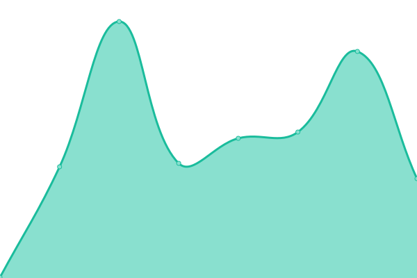 244ms
     
 | 

<a href="https://status.incd.ca/history/space-codelearncreate-org">100.00%</a>
    

|  [inclusivedesign.ca](inclusivedesign.ca) | 游릴 Up | [inclusivedesign-ca.yml](https://github.com/inclusive-design/uptime/commits/HEAD/history/inclusivedesign-ca.yml) | 

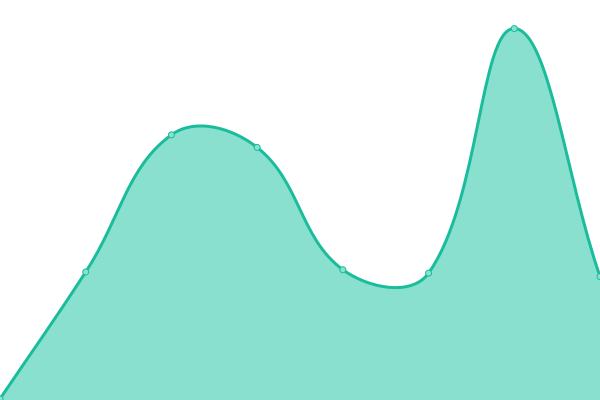 138ms
     
 | 

<a href="https://status.incd.ca/history/inclusivedesign-ca">100.00%</a>
    

|  [tracktime.inclusivedesign.ca](tracktime.inclusivedesign.ca) | 游린 Down | [tracktime-inclusivedesign-ca.yml](https://github.com/inclusive-design/uptime/commits/HEAD/history/tracktime-inclusivedesign-ca.yml) | 

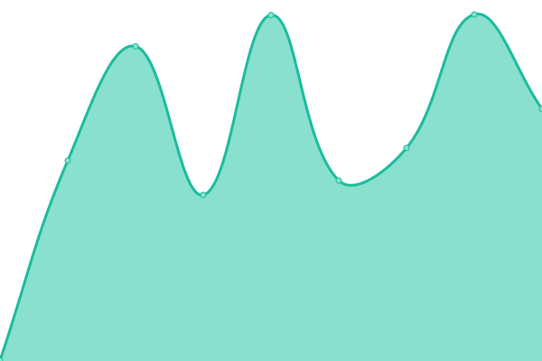 372ms
     
 | 

<a href="https://status.incd.ca/history/tracktime-inclusivedesign-ca">44.03%</a>
    

|  [accessibility-exchange.inclusivedesign.ca](accessibility-exchange.inclusivedesign.ca) | 游릴 Up | [accessibility-exchange-inclusivedesign-ca.yml](https://github.com/inclusive-design/uptime/commits/HEAD/history/accessibility-exchange-inclusivedesign-ca.yml) | 

 145ms
     
 | 

<a href="https://status.incd.ca/history/accessibility-exchange-inclusivedesign-ca">100.00%</a>
    

|  [accessibility-in-action.inclusivedesign.ca](accessibility-in-action.inclusivedesign.ca) | 游릴 Up | [accessibility-in-action-inclusivedesign-ca.yml](https://github.com/inclusive-design/uptime/commits/HEAD/history/accessibility-in-action-inclusivedesign-ca.yml) | 

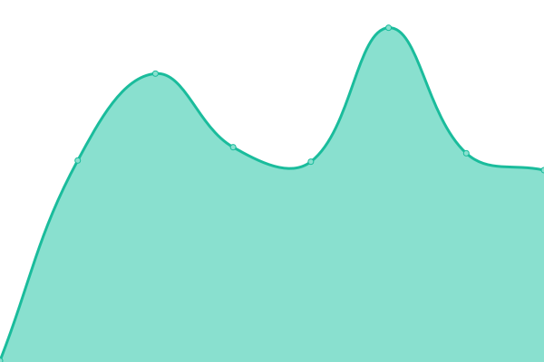 168ms
     
 | 

<a href="https://status.incd.ca/history/accessibility-in-action-inclusivedesign-ca">100.00%</a>
    

|  [aihec.inclusivedesign.ca](aihec.inclusivedesign.ca) | 游릴 Up | [aihec-inclusivedesign-ca.yml](https://github.com/inclusive-design/uptime/commits/HEAD/history/aihec-inclusivedesign-ca.yml) | 

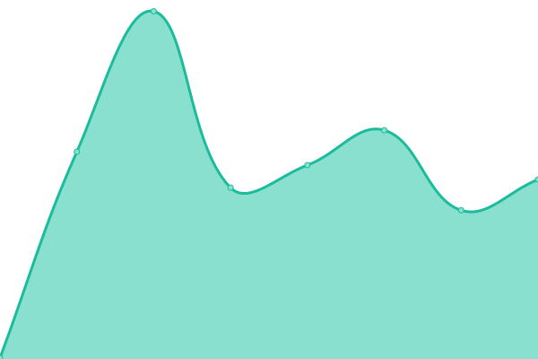 142ms
     
 | 

<a href="https://status.incd.ca/history/aihec-inclusivedesign-ca">100.00%</a>
    

|  [cities.inclusivedesign.ca](cities.inclusivedesign.ca) | 游릴 Up | [cities-inclusivedesign-ca.yml](https://github.com/inclusive-design/uptime/commits/HEAD/history/cities-inclusivedesign-ca.yml) | 

 173ms
     
 | 

<a href="https://status.incd.ca/history/cities-inclusivedesign-ca">100.00%</a>
    

|  [codesign.inclusivedesign.ca](codesign.inclusivedesign.ca) | 游릴 Up | [codesign-inclusivedesign-ca.yml](https://github.com/inclusive-design/uptime/commits/HEAD/history/codesign-inclusivedesign-ca.yml) | 

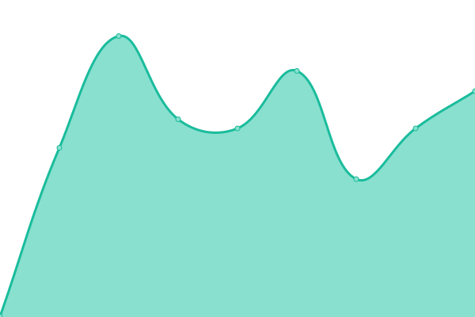 213ms
     
 | 

<a href="https://status.incd.ca/history/codesign-inclusivedesign-ca">100.00%</a>
    

|  [co-design.inclusivedesign.ca](co-design.inclusivedesign.ca) | 游릴 Up | [co-design-inclusivedesign-ca.yml](https://github.com/inclusive-design/uptime/commits/HEAD/history/co-design-inclusivedesign-ca.yml) | 

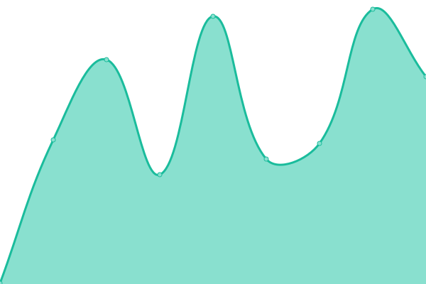 330ms
     
 | 

<a href="https://status.incd.ca/history/co-design-inclusivedesign-ca">100.00%</a>
    

|  [eco-op.inclusivedesign.ca](eco-op.inclusivedesign.ca) | 游릴 Up | [eco-op-inclusivedesign-ca.yml](https://github.com/inclusive-design/uptime/commits/HEAD/history/eco-op-inclusivedesign-ca.yml) | 

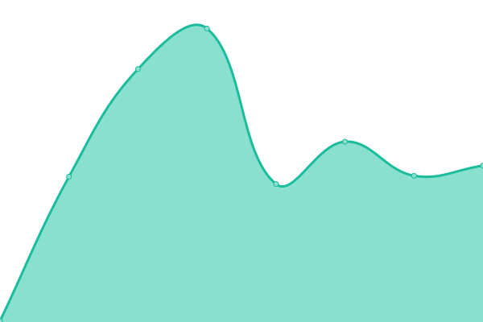 168ms
     
 | 

<a href="https://status.incd.ca/history/eco-op-inclusivedesign-ca">100.00%</a>
    

|  [guide.inclusivedesign.ca](guide.inclusivedesign.ca) | 游릴 Up | [guide-inclusivedesign-ca.yml](https://github.com/inclusive-design/uptime/commits/HEAD/history/guide-inclusivedesign-ca.yml) | 

 155ms
     
 | 

<a href="https://status.incd.ca/history/guide-inclusivedesign-ca">100.00%</a>
    

|  [map.wecount.inclusivedesign.ca](map.wecount.inclusivedesign.ca) | 游릴 Up | [map-wecount-inclusivedesign-ca.yml](https://github.com/inclusive-design/uptime/commits/HEAD/history/map-wecount-inclusivedesign-ca.yml) | 

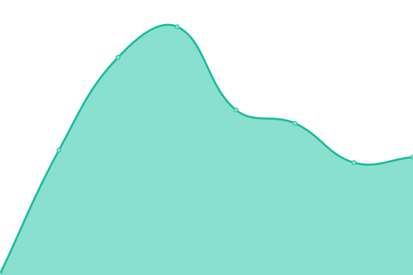 154ms
     
 | 

<a href="https://status.incd.ca/history/map-wecount-inclusivedesign-ca">100.00%</a>
    

|  [stories.cities.inclusivedesign.ca](stories.cities.inclusivedesign.ca) | 游릴 Up | [stories-cities-inclusivedesign-ca.yml](https://github.com/inclusive-design/uptime/commits/HEAD/history/stories-cities-inclusivedesign-ca.yml) | 

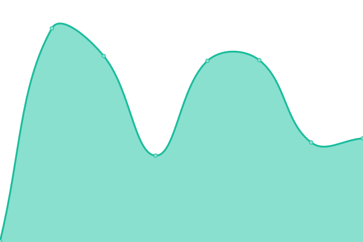 155ms
     
 | 

<a href="https://status.incd.ca/history/stories-cities-inclusivedesign-ca">100.00%</a>
    

|  [wecount.inclusivedesign.ca](wecount.inclusivedesign.ca) | 游릴 Up | [wecount-inclusivedesign-ca.yml](https://github.com/inclusive-design/uptime/commits/HEAD/history/wecount-inclusivedesign-ca.yml) | 

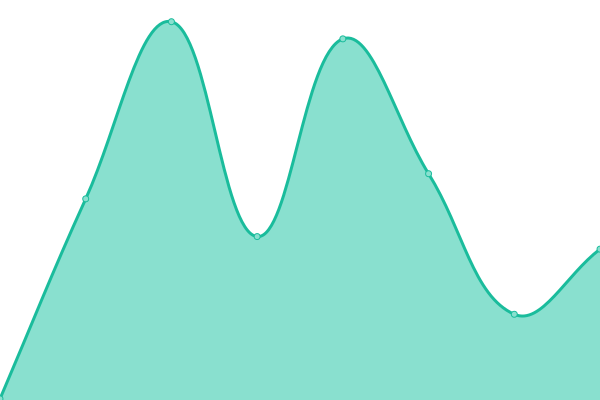 184ms
     
 | 

<a href="https://status.incd.ca/history/wecount-inclusivedesign-ca">100.00%</a>
    

|  [www.inclusivedesign.ca](www.inclusivedesign.ca) | 游릴 Up | [www-inclusivedesign-ca.yml](https://github.com/inclusive-design/uptime/commits/HEAD/history/www-inclusivedesign-ca.yml) | 

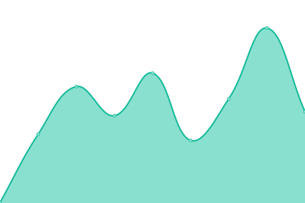 293ms
     
 | 

<a href="https://status.incd.ca/history/www-inclusivedesign-ca">99.54%</a>
    

|  [barrierfree.ca](barrierfree.ca) | 游릴 Up | [barrierfree-ca.yml](https://github.com/inclusive-design/uptime/commits/HEAD/history/barrierfree-ca.yml) | 

 170ms
     
 | 

<a href="https://status.incd.ca/history/barrierfree-ca">100.00%</a>
    

|  [www.barrierfree.ca](www.barrierfree.ca) | 游릴 Up | [www-barrierfree-ca.yml](https://github.com/inclusive-design/uptime/commits/HEAD/history/www-barrierfree-ca.yml) | 

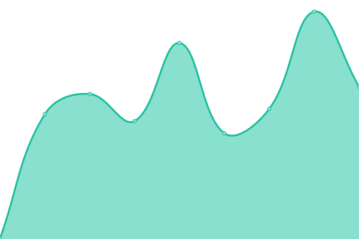 283ms
     
 | 

<a href="https://status.incd.ca/history/www-barrierfree-ca">99.54%</a>
    

|  [idrc.ocad.ca](idrc.ocad.ca) | 游릴 Up | [idrc-ocad-ca.yml](https://github.com/inclusive-design/uptime/commits/HEAD/history/idrc-ocad-ca.yml) | 

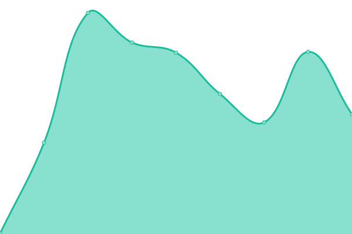 236ms
     
 | 

<a href="https://status.incd.ca/history/idrc-ocad-ca">100.00%</a>
    

|  [lists.idrc.ocad.ca](lists.idrc.ocad.ca) | 游릴 Up | [lists-idrc-ocad-ca.yml](https://github.com/inclusive-design/uptime/commits/HEAD/history/lists-idrc-ocad-ca.yml) | 

 1094ms
     
 | 

<a href="https://status.incd.ca/history/lists-idrc-ocad-ca">100.00%</a>
    

|  [adod.idrc.ocad.ca](adod.idrc.ocad.ca) | 游릴 Up | [adod-idrc-ocad-ca.yml](https://github.com/inclusive-design/uptime/commits/HEAD/history/adod-idrc-ocad-ca.yml) | 

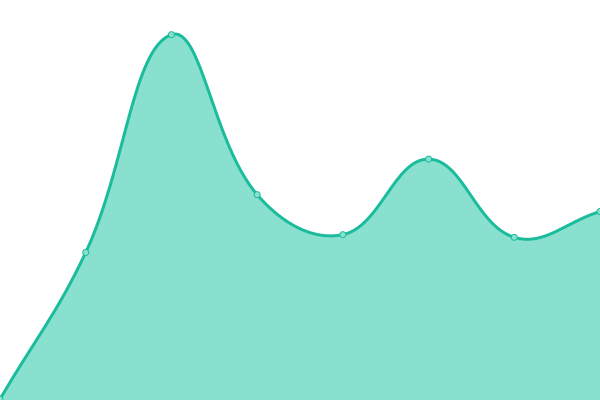 170ms
     
 | 

<a href="https://status.incd.ca/history/adod-idrc-ocad-ca">100.00%</a>
    

|  [aegis.idrc.ocad.ca](aegis.idrc.ocad.ca) | 游릴 Up | [aegis-idrc-ocad-ca.yml](https://github.com/inclusive-design/uptime/commits/HEAD/history/aegis-idrc-ocad-ca.yml) | 

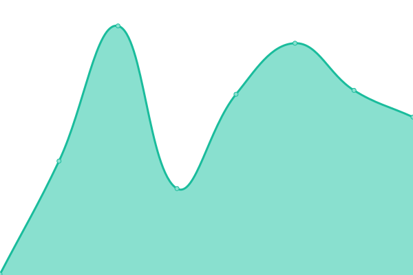 169ms
     
 | 

<a href="https://status.incd.ca/history/aegis-idrc-ocad-ca">100.00%</a>
    

|  [clown.idrc.ocad.ca](clown.idrc.ocad.ca) | 游릴 Up | [clown-idrc-ocad-ca.yml](https://github.com/inclusive-design/uptime/commits/HEAD/history/clown-idrc-ocad-ca.yml) | 

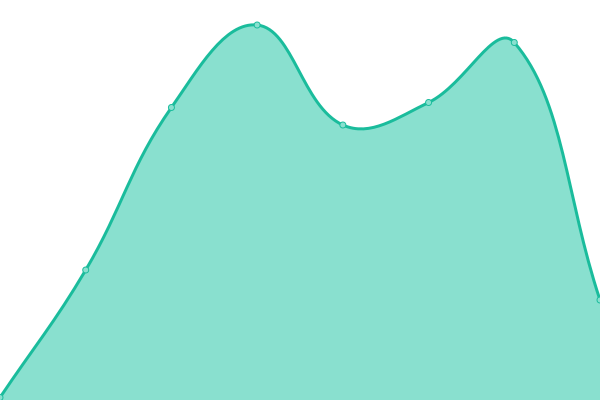 93ms
     
 | 

<a href="https://status.incd.ca/history/clown-idrc-ocad-ca">100.00%</a>
    

|  [cnice.idrc.ocad.ca](cnice.idrc.ocad.ca) | 游릴 Up | [cnice-idrc-ocad-ca.yml](https://github.com/inclusive-design/uptime/commits/HEAD/history/cnice-idrc-ocad-ca.yml) | 

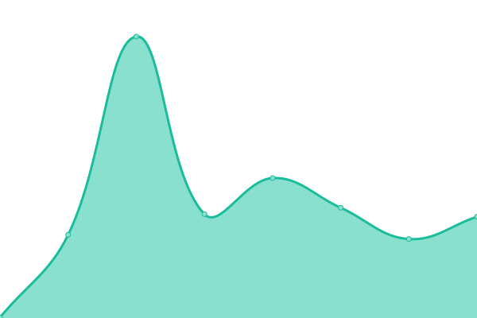 161ms
     
 | 

<a href="https://status.incd.ca/history/cnice-idrc-ocad-ca">100.00%</a>
    

|  [courses.idrc.ocad.ca](courses.idrc.ocad.ca) | 游릴 Up | [courses-idrc-ocad-ca.yml](https://github.com/inclusive-design/uptime/commits/HEAD/history/courses-idrc-ocad-ca.yml) | 

 156ms
     
 | 

<a href="https://status.incd.ca/history/courses-idrc-ocad-ca">100.00%</a>
    

|  [culturall.idrc.ocad.ca](culturall.idrc.ocad.ca) | 游릴 Up | [culturall-idrc-ocad-ca.yml](https://github.com/inclusive-design/uptime/commits/HEAD/history/culturall-idrc-ocad-ca.yml) | 

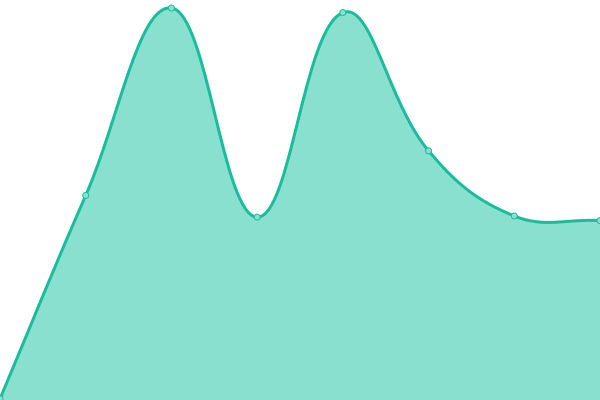 160ms
     
 | 

<a href="https://status.incd.ca/history/culturall-idrc-ocad-ca">100.00%</a>
    

|  [culturall1.idrc.ocad.ca](culturall1.idrc.ocad.ca) | 游릴 Up | [culturall1-idrc-ocad-ca.yml](https://github.com/inclusive-design/uptime/commits/HEAD/history/culturall1-idrc-ocad-ca.yml) | 

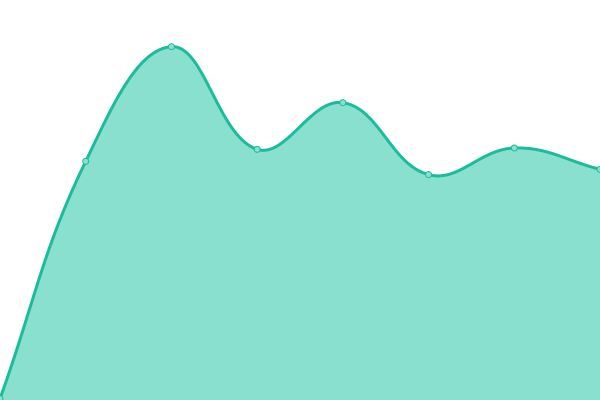 176ms
     
 | 

<a href="https://status.incd.ca/history/culturall1-idrc-ocad-ca">100.00%</a>
    

|  [culturall2.idrc.ocad.ca](culturall2.idrc.ocad.ca) | 游릴 Up | [culturall2-idrc-ocad-ca.yml](https://github.com/inclusive-design/uptime/commits/HEAD/history/culturall2-idrc-ocad-ca.yml) | 

 160ms
     
 | 

<a href="https://status.incd.ca/history/culturall2-idrc-ocad-ca">100.00%</a>
    

|  [deep.idrc.ocad.ca](deep.idrc.ocad.ca) | 游릴 Up | [deep-idrc-ocad-ca.yml](https://github.com/inclusive-design/uptime/commits/HEAD/history/deep-idrc-ocad-ca.yml) | 

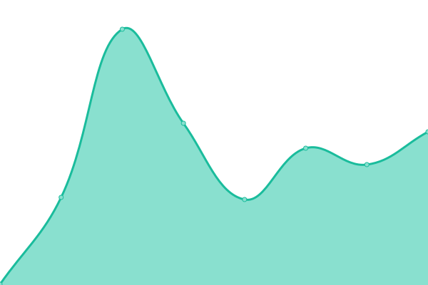 148ms
     
 | 

<a href="https://status.incd.ca/history/deep-idrc-ocad-ca">100.00%</a>
    

|  [ilc.idrc.ocad.ca](ilc.idrc.ocad.ca) | 游릴 Up | [ilc-idrc-ocad-ca.yml](https://github.com/inclusive-design/uptime/commits/HEAD/history/ilc-idrc-ocad-ca.yml) | 

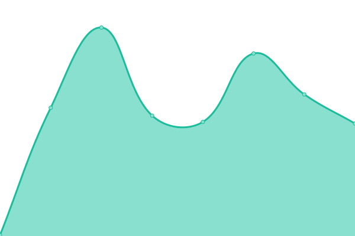 174ms
     
 | 

<a href="https://status.incd.ca/history/ilc-idrc-ocad-ca">100.00%</a>
    

|  [legacy.idrc.ocad.ca](legacy.idrc.ocad.ca) | 游릴 Up | [legacy-idrc-ocad-ca.yml](https://github.com/inclusive-design/uptime/commits/HEAD/history/legacy-idrc-ocad-ca.yml) | 

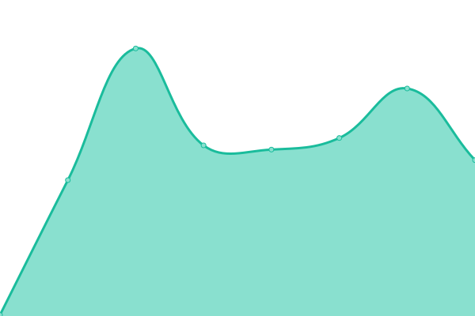 166ms
     
 | 

<a href="https://status.incd.ca/history/legacy-idrc-ocad-ca">100.00%</a>
    

|  [nide.idrc.ocad.ca](nide.idrc.ocad.ca) | 游릴 Up | [nide-idrc-ocad-ca.yml](https://github.com/inclusive-design/uptime/commits/HEAD/history/nide-idrc-ocad-ca.yml) | 

 150ms
     
 | 

<a href="https://status.incd.ca/history/nide-idrc-ocad-ca">100.00%</a>
    

|  [opencaps.idrc.ocad.ca](opencaps.idrc.ocad.ca) | 游릴 Up | [opencaps-idrc-ocad-ca.yml](https://github.com/inclusive-design/uptime/commits/HEAD/history/opencaps-idrc-ocad-ca.yml) | 

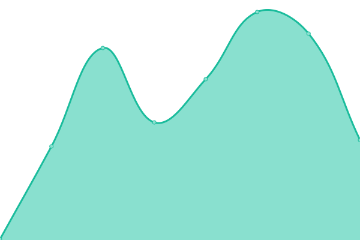 128ms
     
 | 

<a href="https://status.incd.ca/history/opencaps-idrc-ocad-ca">100.00%</a>
    

|  [opendoors.idrc.ocad.ca](opendoors.idrc.ocad.ca) | 游릴 Up | [opendoors-idrc-ocad-ca.yml](https://github.com/inclusive-design/uptime/commits/HEAD/history/opendoors-idrc-ocad-ca.yml) | 

 155ms
     
 | 

<a href="https://status.incd.ca/history/opendoors-idrc-ocad-ca">100.00%</a>
    

|  [outside-in.idrc.ocad.ca](outside-in.idrc.ocad.ca) | 游릴 Up | [outside-in-idrc-ocad-ca.yml](https://github.com/inclusive-design/uptime/commits/HEAD/history/outside-in-idrc-ocad-ca.yml) | 

 178ms
     
 | 

<a href="https://status.incd.ca/history/outside-in-idrc-ocad-ca">100.00%</a>
    

|  [pipedaproject.idrc.ocad.ca](pipedaproject.idrc.ocad.ca) | 游릴 Up | [pipedaproject-idrc-ocad-ca.yml](https://github.com/inclusive-design/uptime/commits/HEAD/history/pipedaproject-idrc-ocad-ca.yml) | 

 142ms
     
 | 

<a href="https://status.incd.ca/history/pipedaproject-idrc-ocad-ca">100.00%</a>
    

|  [snow.idrc.ocad.ca](snow.idrc.ocad.ca) | 游릴 Up | [snow-idrc-ocad-ca.yml](https://github.com/inclusive-design/uptime/commits/HEAD/history/snow-idrc-ocad-ca.yml) | 

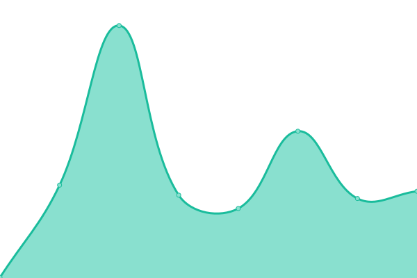 144ms
     
 | 

<a href="https://status.incd.ca/history/snow-idrc-ocad-ca">100.00%</a>
    

|  [static.idrc.ocad.ca](static.idrc.ocad.ca) | 游릴 Up | [static-idrc-ocad-ca.yml](https://github.com/inclusive-design/uptime/commits/HEAD/history/static-idrc-ocad-ca.yml) | 

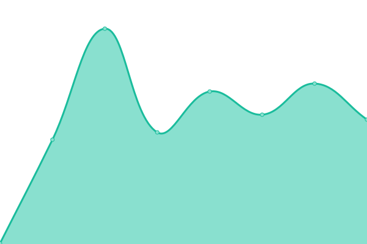 136ms
     
 | 

<a href="https://status.incd.ca/history/static-idrc-ocad-ca">100.00%</a>
    

|  [stretch.idrc.ocad.ca](stretch.idrc.ocad.ca) | 游릴 Up | [stretch-idrc-ocad-ca.yml](https://github.com/inclusive-design/uptime/commits/HEAD/history/stretch-idrc-ocad-ca.yml) | 

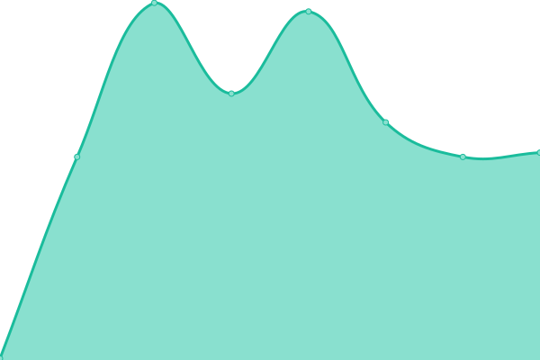 134ms
     
 | 

<a href="https://status.incd.ca/history/stretch-idrc-ocad-ca">100.00%</a>
    

|  [www.idrc.ocad.ca](www.idrc.ocad.ca) | 游릴 Up | [www-idrc-ocad-ca.yml](https://github.com/inclusive-design/uptime/commits/HEAD/history/www-idrc-ocad-ca.yml) | 

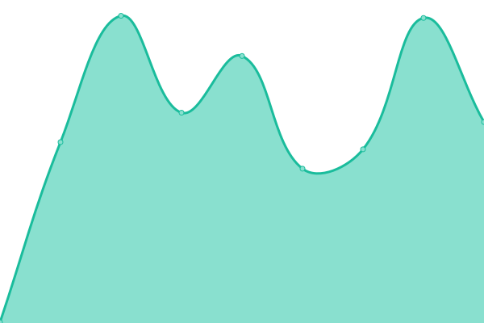 179ms
     
 | 

<a href="https://status.incd.ca/history/www-idrc-ocad-ca">100.00%</a>
    

|  [www.snow.idrc.ocad.ca](www.snow.idrc.ocad.ca) | 游릴 Up | [www-snow-idrc-ocad-ca.yml](https://github.com/inclusive-design/uptime/commits/HEAD/history/www-snow-idrc-ocad-ca.yml) | 

 152ms
     
 | 

<a href="https://status.incd.ca/history/www-snow-idrc-ocad-ca">100.00%</a>
    

|  [fluidengage.org](fluidengage.org) | 游릴 Up | [fluidengage-org.yml](https://github.com/inclusive-design/uptime/commits/HEAD/history/fluidengage-org.yml) | 

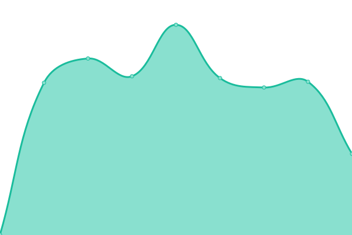 60ms
     
 | 

<a href="https://status.incd.ca/history/fluidengage-org">100.00%</a>
    

|  [www.fluidengage.org](www.fluidengage.org) | 游릴 Up | [www-fluidengage-org.yml](https://github.com/inclusive-design/uptime/commits/HEAD/history/www-fluidengage-org.yml) | 

 186ms
     
 | 

<a href="https://status.incd.ca/history/www-fluidengage-org">100.00%</a>
    

|  [includenet.ca](includenet.ca) | 游릴 Up | [includenet-ca.yml](https://github.com/inclusive-design/uptime/commits/HEAD/history/includenet-ca.yml) | 

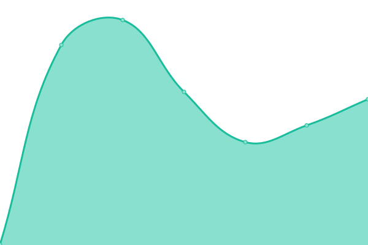 334ms
     
 | 

<a href="https://status.incd.ca/history/includenet-ca">99.61%</a>
    

|  [www.includenet.ca](www.includenet.ca) | 游릴 Up | [www-includenet-ca.yml](https://github.com/inclusive-design/uptime/commits/HEAD/history/www-includenet-ca.yml) | 

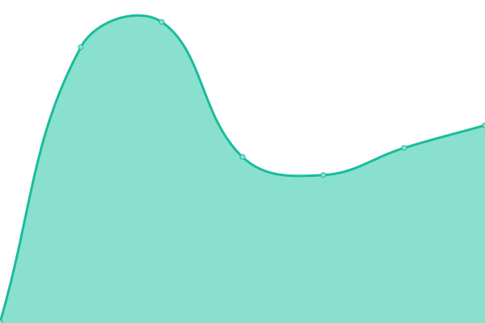 281ms
     
 | 

<a href="https://status.incd.ca/history/www-includenet-ca">99.61%</a>
    

|  [web4all.ca](web4all.ca) | 游릴 Up | [web4all-ca.yml](https://github.com/inclusive-design/uptime/commits/HEAD/history/web4all-ca.yml) | 

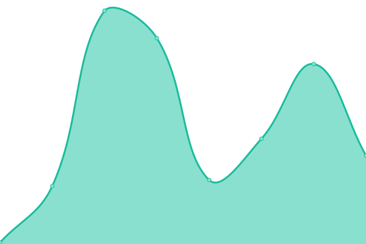 78ms
     
 | 

<a href="https://status.incd.ca/history/web4all-ca">100.00%</a>
    

|  [www.web4all.ca](www.web4all.ca) | 游릴 Up | [www-web4all-ca.yml](https://github.com/inclusive-design/uptime/commits/HEAD/history/www-web4all-ca.yml) | 

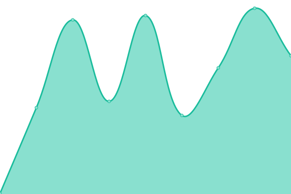 279ms
     
 | 

<a href="https://status.incd.ca/history/www-web4all-ca">99.61%</a>
    

|  [unpopular.ca](unpopular.ca) | 游릴 Up | [unpopular-ca.yml](https://github.com/inclusive-design/uptime/commits/HEAD/history/unpopular-ca.yml) | 

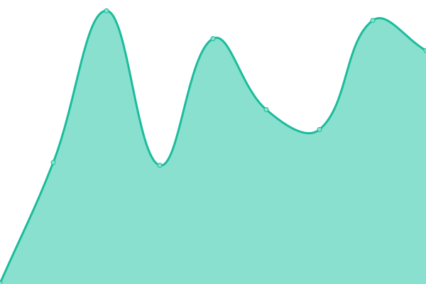 322ms
     
 | 

<a href="https://status.incd.ca/history/unpopular-ca">99.61%</a>
    

|  [www.unpopular.ca](www.unpopular.ca) | 游릴 Up | [www-unpopular-ca.yml](https://github.com/inclusive-design/uptime/commits/HEAD/history/www-unpopular-ca.yml) | 

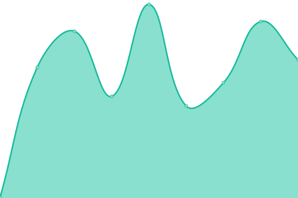 292ms
     
 | 

<a href="https://status.incd.ca/history/www-unpopular-ca">99.61%</a>
    

|  [inverted-wordclouds.inclusivedesign.ca](inverted-wordclouds.inclusivedesign.ca) | 游릴 Up | [inverted-wordclouds-inclusivedesign-ca.yml](https://github.com/inclusive-design/uptime/commits/HEAD/history/inverted-wordclouds-inclusivedesign-ca.yml) | 

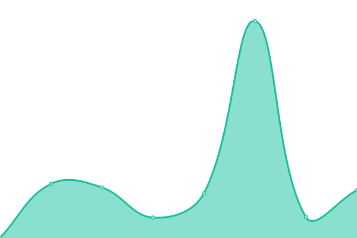 311ms
     
 | 

<a href="https://status.incd.ca/history/inverted-wordclouds-inclusivedesign-ca">100.00%</a>
    

|  [consulting.inclusivedesign.ca](consulting.inclusivedesign.ca) | 游린 Down | [consulting-inclusivedesign-ca.yml](https://github.com/inclusive-design/uptime/commits/HEAD/history/consulting-inclusivedesign-ca.yml) | 

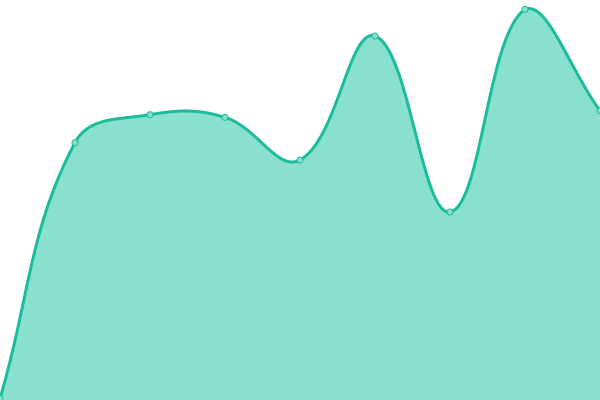 292ms
     
 | 

<a href="https://status.incd.ca/history/consulting-inclusivedesign-ca">43.63%</a>
    

|  [dev.consulting.inclusivedesign.ca](dev.consulting.inclusivedesign.ca) | 游릴 Up | [dev-consulting-inclusivedesign-ca.yml](https://github.com/inclusive-design/uptime/commits/HEAD/history/dev-consulting-inclusivedesign-ca.yml) | 

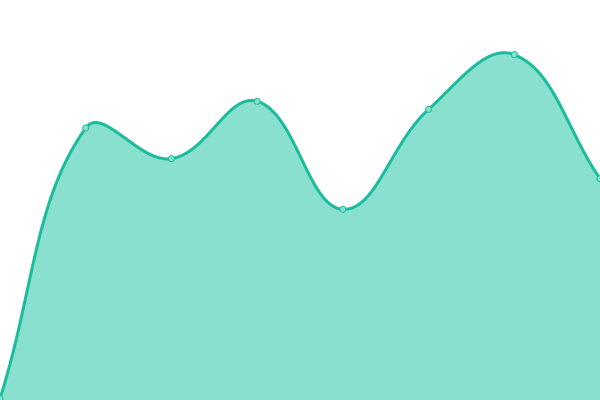 206ms
     
 | 

<a href="https://status.incd.ca/history/dev-consulting-inclusivedesign-ca">100.00%</a>
    

<!--end: status pages-->

[**Visit our status website **](https://inclusive-design.github.io/uptime)

## 游늯 License

- Powered by: [Upptime](https://github.com/upptime/upptime)
- Code: [MIT](./LICENSE) 춸 [Anand Chowdhary](https://anandchowdhary.com), supported by [Pabio](https://pabio.com)
- Data in the `./history` directory: [Open Database License](https://opendatacommons.org/licenses/odbl/1-0/)
